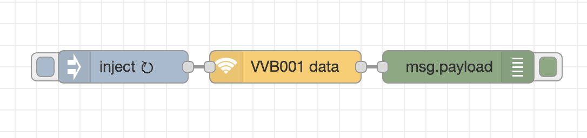
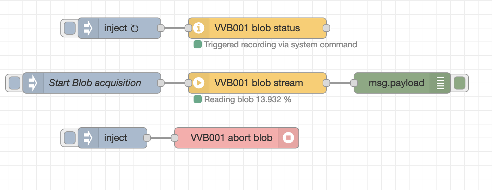

# node-red-contrib-ifm-vvb001

[Node-RED](http://nodered.org) nodes that handles data transfers from [IFM VVB sensors](https://www.ifm.com/fr/en/product/VVB001).

It includes the following nodes to retrieve monitoring data and transfer a raw acceleration **BLOB**\*:

- `get data`: Gets the monitoring data from a VVB sensorO (V rms, A rms, A peak, Temperature and Crest).
- `stream blob`: Start a BLOB generation, extract it and convert it to m/s^2 unit.
- `blob status`: Return the status of the BLOB (ex: transmission is in progress or idle)
- `abort blob` : Run the abort BLOB transfer command. If the data transfer must be stopped before the end of the transfer, the transfer must be aborted. If not, a new Start command for reading the BLOB can't be raised with success.

\*A **BLOB** is a record of raw acceleration at a high frequency (4 seconds at a frequency of 25 KHz which represents a time serie of 100K values)

<a name="installation"></a>

# Installation

<a name="installation_in_node-red"></a>

## In Node-RED (preferred)

- Via Manage Palette -> Search for "node-red-contrib-ifm-vvb001"

<a name="installation_in_a_shell"></a>

## In a shell

Basic installation:

- go to the Node-RED "userDir" folder, typically `~/.node-red`
- run `npm install node-red-contrib-ifm-vvb001`

# Usage

<a name="usage"></a>

## Usage of _get data_

<a name="usage_get_data"></a>

The easiest usage of the node `get data` is the following:



This node will return a modified `msg` with the following `payload`:

```json
{
  "data": {
    "v_Rms": 0.0001,
    "a_Peak": 0.2,
    "a_Rms": 0,
    "Temperature": 33,
    "Crest": 4.2,
    "status": "OK"
  },
  "ts": "2022-07-07T21:32:22.133Z"
}
```

where:

- `v_Rms` is the speed root mean square in m/s
- `a_Peak` is the acceleration peak in m/s^2
- `a_Rms` is the acceleration root mean square in m/s^2
- `Temperature` is the temperature is celsius degrees
- `Crest`
- `Status` is the device status
- `ts` is the timestamp of this event

## Usage of _stream blob_

<a name="usage_stream_blob"></a>

The easiest usage of the node `stream blob` is the following:



The `blob status` node check if there is an ongoing blob acquisition. If it is the case, you cannot run stream blob until the actual blob transfer is finished or aborted using `abort blob`.",

The `stream blob` node will return a modified `msg` with the following `payload`:

```json
{
  "ts": "2022-07-07T21:43:34.542Z",
  "length": 200000,
  "acceleration": [
    1.010053825378418,
    1.0848726272583007,
    1.1035773277282714,
    "..."
  ],
  "crc": "4076F8421C"
}
```

where:

- `length` is the BLOB length in bytes (200K)
- `acceleration` is the raw acceleration recorded on 4 seconds using 25 KHz acquisition (vector of 100K values)
- `crc` is the CRC signature of the BLOB
- `ts` is the start timestamp of this recording
